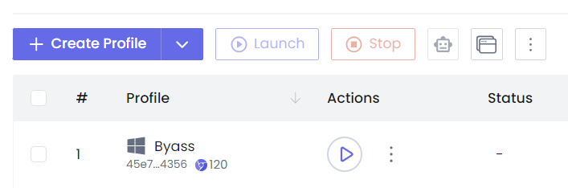

# ChagtGPT Free Proxy

Build app just like you use OpenAI (ClosedAI) Official API but it's not GPT models, it's Llama.

**Model List:**

- meta-llama-3-8b-instruct
- meta--llama-3-70b-instruct
- meta-llama-2-8b-instruct
- meta--llama-2-70b-instruct

### Requirememts

- NSTbrowser
- NSTbrowser API Key (Free)
- Node.js

## Configuration

```
git clone https://github.com/nishantshah977/ChatGPT
```

- Download NSTbrowser from <a href="https://app.nstbrowser.io/r/nishantshah977">Affiliate Link</a>.
- Follow upto step 2, <a href="https://www.nstbrowser.io/blog/getting-cloudflare-turnstile-token-with-nstbrowser">Here</a>



- Click on Create Profile, fill up and start
- Copy it and save it to .env file
- Get API Key from API Section

```
npm run start
```

# Usage

**Python**

```python
import openai

openai.api_key = 'anything'
openai.base_url = "http://localhost:3040/v1/"

completion = openai.chat.completions.create(
    model="gpt-3.5-turbo",
    messages=[
        {"role": "user", "content": "How do I list all files in a directory using Python?"},
    ],
)

print(completion.choices[0].message.content)
```

**Javascript**

```javascript
import OpenAI from "openai";

const openai = new OpenAI({
  apiKey: "anything",
  baseURL: "http://localhost:3040/v1",
});

const chatCompletion = await openai.chat.completions.create({
  messages: [{ role: "user", content: "Say this is a test" }],
  model: "gpt-3.5-turbo",
});

console.log(chatCompletion.choices[0].message.content);
```

**CURL**

```curl
curl http://localhost:port/v1/chat/completions \
  -H "Content-Type: application/json" \
  -d '{
    "model": "gpt-3.5-turbo",
    "messages": [
      {
        "role": "system",
        "content": "You are a helpful assistant."
      },
      {
        "role": "user",
        "content": "Who won the world series in 2020?"
      },
      {
        "role": "assistant",
        "content": "The Los Angeles Dodgers won the World Series in 2020."
      },
      {
        "role": "user",
        "content": "Where was it played?"
      }
    ]
  }'
```

**Thanks To**

1. <a href="https://github.com/PawanOsman/ChatGPT">https://github.com/PawanOsman/ChatGPT</a> (Chatgpt Request and Response)
2. <a href="https://www.nstbrowser.io/">NSTbrowser</a> (Bypass Turnstile)
